<h1>How Confirmation Bias Ruined My Backlink Data Analysis</h1>

In this page, I will show how confirmation bias has ruined my data analysis project, for which I spent countless hours. Had I done a very simple check in the beginning of the analysis, I probably would have been able to avoid this mishap. I am writing this so others won't repeat the mistake I made, hopefully.

<h3>Basic Terms</h3>
<a href='http://en.wikipedia.org/wiki/Backlink' target='_blank'>Definition of backlinks from Wikipedia</a>:
<blockquote>Backlinks... are incoming links to a website or web page. Backlinks were originally important (prior to the emergence of search engines) as a primary means of web navigation; today, their significance lies in search engine optimization (SEO). The number of backlinks is one indication of the popularity or importance of that website or page (for example, this is used by Google to determine the PageRank of a webpage).</blockquote>

<a href='http://en.wikipedia.org/wiki/Link_building' target='_blank'>Definition of link building from Wikipedia</a>:
<blockquote>link building describes actions aimed at increasing the number and quality of inbound links to a page.</blockquote>

<h3>History of Backlinks</h3>
Before Google introduced its Penguin algorithm in April 2012, many SEO specialists participated in spammy link building, in which they attempted--and often succeeded in--manupulating Google's search engine algorithm to boost their websites into users' top search results. They did so by placing high volumns of low-quality incoming links from other websites to their client's website without examining topical relevancy or trustworthiness of those linking sites. In other words, they placed a high priority only in the <i><strong>number</strong></i> of these backlinks, not the <i><strong>quality</strong></i>. This was a common practice in the SEO industry, including the company for which I am employeed now.

However, in the ever-changing world of SEO, Google announced its revamped search ranking algorithm in April 24, 2012, known as the <a href='http://en.wikipedia.org/wiki/Google_Penguin' target='_blank'>Penguin update</a>. Google Penguin caused a major historical shift in the world of SEO as it penalized websites benefitted from artificial spammy link building activities. As a result, many websites lifted in this fashion dropped from users' search results like dead flies. According to one poll, as much as 63% of website owners reported that their sites were negatively affected, with many never recovering from the hit.

<h3>What I Tried to Examine</h3>
When I first joined my current SEO company in February 2013, I was told that a former employee (to whom I will refer as "John") was an active link builder whose techniques became outdated, and in fact, harmful for SEO after the Penguin update. John left the company right before Google announced its Penguin algorithm, and when the company learned about it, it decided to deploy a new link building strategy for its SEO clients. Just curious, I wanted to examine how the company's new link building strategy improved over John's old link building methods.

<h3>My Misled Process</h3>
I started by downloading spreadsheet data for the 11 SEO clients' websites that existed either before or during John's employment. I didn't download data for the new SEO clients that came after Google's Penguin update because I wouldn't have any backlink data dating back to April 2012, which was fine. I also did not bother downloading data for non-SEO clients' websites since I figured I would have no use for them (<strong>first mistake</strong>). After all, I was trying to analyze the link building activities for our SEO clients, not for non-SEO clients. Just like that, I failed to establish a baseline for my findings. 

After downloading and cleaning the data, I plotted the number of new sites linking to our clients' websites by time, which rendered this:  
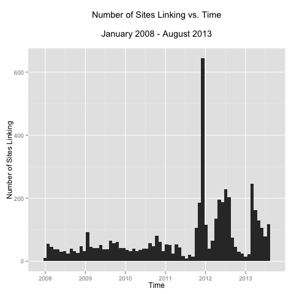 

I was interested to see that there was a noticeable peak near the end of 2011 that soared through the chart, followed by two additional waves of fresh linking websites, which I took as an evidence of link building activities (<strong>second mistake</strong>). 

I placed color-coded timeframes onto the graph to provide a better visualization. 
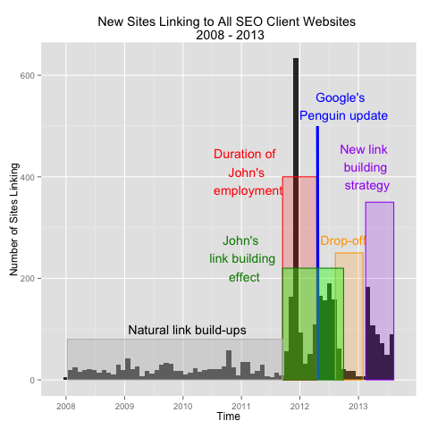  
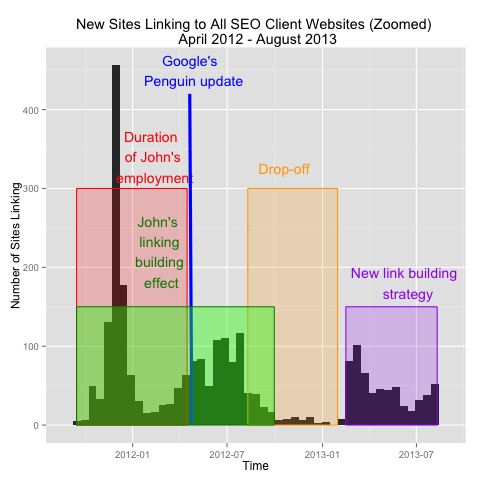 

It should be noted that, while I was certain that John left his job sometime in mid-April, I did not have his definitive employment start date; I only knew he started working for the company sometime in the latter half of 2011. So instead of matching his exact employment start date, I looked at the above plot and <i>assumed</i> that John's employment began sometime near mid-September, 2011 (<strong>third mistake</strong>). 

Looking at the graph, I noticed that there continued to have been additional websites that were linking to our SEO clients' websites <i>after</i> John parted the company. That should have raised a red flag. And it did, when I first started this analysis 6 months back. However, when I resumed the analysis couple weeks ago, I justified the finding by noting that John's used to hire a third party agecy, which I presumed to have continued to participate in link building activities even after John's departure (<strong>fourth mistake</strong>). 

Lastly, I had no hard evidence to attribute the second wave of additional linking websites (marked by purple) to our company's new link building strategy. I assumed that it was the work of ours simply because there was a noticeable peak and I assumed that small business websites don't normally accrue backlinks on their own (<strong>fifth mistake</strong>). 

Below is an excerpt from my initial report write-up:
<blockquote>
We can clearly see that there had been continued link building activities, even after John left the company. That's because John had utilized a third party agency to do his link buildings. So even after he left, the third party agency continued to create backlinks because the orders had already been submitted by John. Hence, the green marks the (exntended) effective timeframe for John's link building work. After a hiatus, my company hired another SEO consultant under whom it resumed its link building activities with a new strategy and that's the purple mark on the graph. 
</blockquote>

Plotting the number of additional sites linking versus time for each of our SEO client's site only further confirmed my previous (misled) notion. 
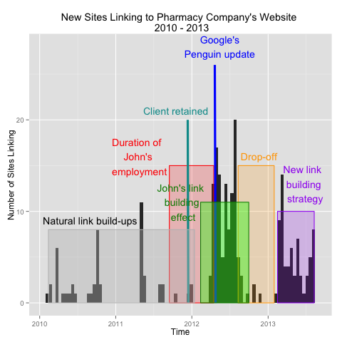 
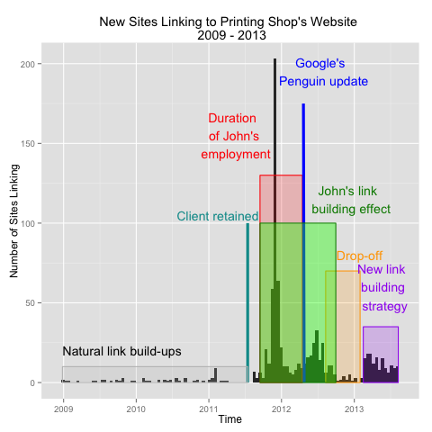 
 
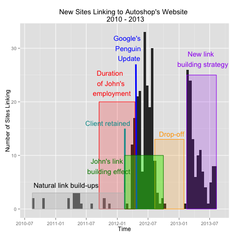 
 
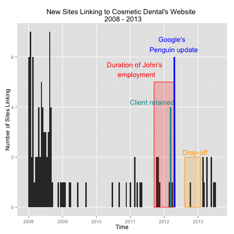 
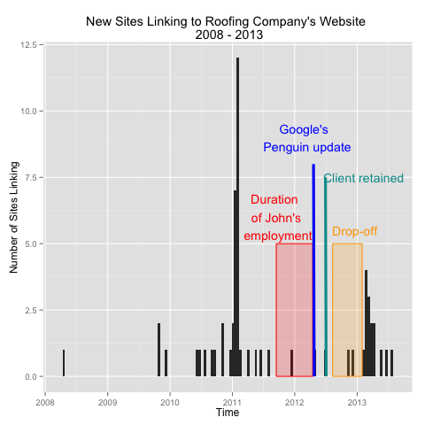 
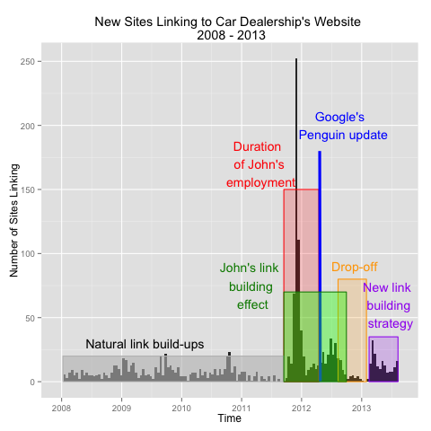  

After nitpicking on the looks of each graph, I decided to analyze the differences of the linking sites created under "John's link building program" (call it Old Link-Building group) against those created under the company's "new strategy" (New Link-Building group). There were three things I noticed. 

1. Interestingly enough, there were less backlinks per site in the New Link-Building group (average of 12.23 backlinks per site) than in the Old Link-Building group (average of 14.91 backlinks per site). That made sense, provided that our company focused more on the quality of backlinks rather than the sheer quantity. Under the new strategy, we in fact focused on creating fewer but better quality backlinks (as opposed to more but lower quality backlinks). It sure felt like I was off to a good start. 

2. I also compared the average trustworthiness (<a href='http://searchengineland.com/majestic-seo-announces-new-link-metrics-trust-flow-citation-flow-121230' target='_blank'>Trust Flow metric</a>) of linking websites in the Old Link-Building group to that in the New Link-Building group. Because I presumed John participated in excessive spammy link building during his employment, I expected to see lower trustworthiness score (a metric provided in Majestic SEO's data) in the Old Link-Building group than in the New Link-Building gruop. In this area, however, I observed no significant discrepency.
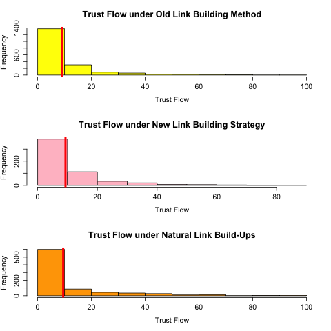 

3. Lastly, I compared the average site authority score (<a href='http://searchengineland.com/majestic-seo-announces-new-link-metrics-trust-flow-citation-flow-121230' target='_blank'>Citation Flow metric</a>) of linking websites in the Old Link-Building group to that in the New Link-Building group. The average site authority score in the Old Link-Building group: <strong>19.83</strong>. The average site authority score in the New Link-Building group: <strong>23.58</strong>. This finding partially reaffirmed my belief that the new link building strategy was creating incoming links from websites with higher site authorithy (i.e. better quality, more legitimate websites), although I hadn't yet determined its statistical significance. 
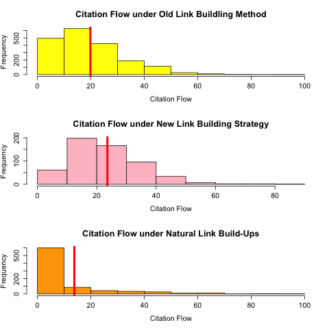 

<h3>How I Found My Mistake</h3>
Toward the end of my analysis, for the sake of completeness, I decided to do a last-minute plotting of the new linking sites versus time <strong>for non-SEO sites</strong>. I anticipated a flat graph with no high spikes. However, this is what I got: 
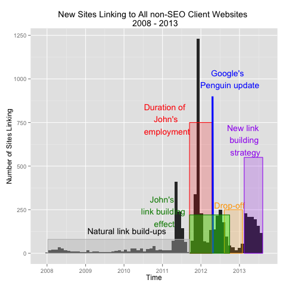 

The graph looked almost identical to plot I drew for SEO-only clients. I couldn't believe it. How could the graph have signs of link building activities when our company (neither under John or under the new link building strategy) created backlinks for them? 
For a while, I had to re-check that I wasn't redrawing the first graph and that I was using the right data. 

<h3>Conclusion</h3>
So what happened? I cannot say until I conduct a further analysis. But it appears that there were spammy web directories that troll around and add spammy links to other websites found on the Internet for both SEO and non-SEO websites. <strong>The high peaks in the graph were results of neither John's link building work or the new strategy.</strong> 

The lesson from this failed data analysis project is that <strong>one must ALWAYS, ALWAYS, ALWAYS have a baseline to compare and contrast his findings.</strong> In other words, there always needs to be two groups: control and variable. 

I also learned that I should <strong>never, ever, ever, ever, ever assume anything.</strong> Confirmation bias is a trickery of mind. One should avoid falling victim to the trick of his own mind by placing heavy caution against confirmation bias (or any kind of bias for that matter). 

<h3>Note</h3>
1. It is unclear how often Majestic SEO crawls sites to accurately determine "first link date" and "last link date". However, it is highly doubtful that their web crawler indexes every website in the world every day. (With such high data volumn, it would be an impossible feat.) Therefore, the first and last link date does not necessarily reflect the <i>actual</i> dates but rough estimates thereof. This is also mentioned in the Majestic SEO's website: "Due to limitations of storage, the first crawl date degrades in accuracy after 150 days." The analysis accounted for this 

2. For the sake of our SEO clients' privacy, their business names and web URLs have been masked. Also, "John" is a pseudonym for the discussed former employee.

<h3>Folder Structure</h3>
<strong>data</strong>: This folder contains the raw spreadsheet data downloaded from <a href="https://www.majesticseo.com" target="_blank">Majestic SEO</a>. 
<strong>output</strong>: This folder contains the visual graphs produced from analyzing the dataset. 
<strong>script</strong>: This folder contains the R script that was used to analyzed the spreadsheet data. 

<h3>Consideration for Further Analysis</h3>
Going forward, I would like to know how some of these small business websites accrused such high volumns of unnatural backlinks from topically unrelated websites with spammy contents. That is, what triggered some sites to be the target of backlinks while others have not?

After answering this question, it would be extremely interesting to see if a machine learning or cluster algorithm can be applied to the raw data to distinguish spammy backlinks from legitimate incoming links. If we can successfully pick out all the bad, spammy backlinks automatically, then my SEO company can submit a request to Google through the <a href='https://www.google.com/webmasters/tools/disavow-links-main' target='_target'>Disavow Tool</a>, removing all spammy backlinks from Google's consideration when it calculates search rankings for our clients' websites, hence avoiding adverse search rank penalty from Google. 
